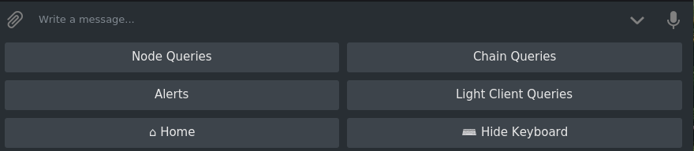
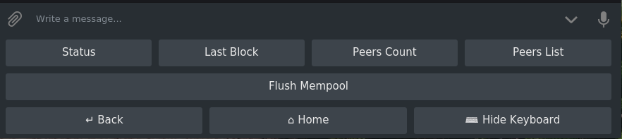
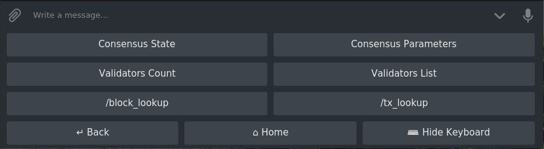
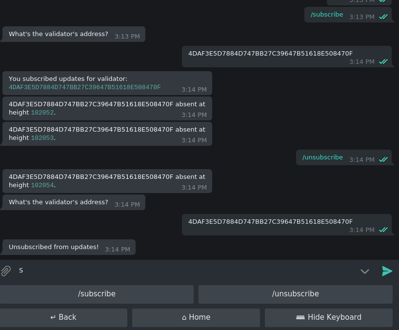
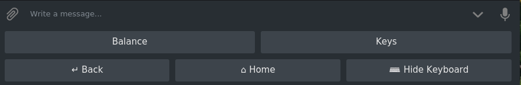
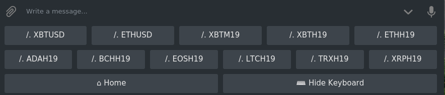

# Botelicious - ;) 
A Discord bot for making node-specific queries, while featuring a simple alerting system. Currently supports:<br>
- Cosmos<br>
- Irisnet

## Downloads
**Prerequisite**
- [node.js](https://nodejs.org/en/download/package-manager/#debian-and-ubuntu-based-linux-distributions-enterprise-linux-fedora-and-snap-packages)
<br/>```$ curl -sL https://deb.nodesource.com/setup_11.x | sudo -E bash -```<br/>```$ sudo apt-get install -y nodejs```<br>
1. ```$ git clone https://github.com/jim380/Botelicious```
## Configuration
####Telegram
2. ```$ cd Botelicious/Telegram```
3. ```$ nano config.json``` and fill in the empty field for ```"url"```. You may change the prefix too if you like.<br>
4. ```$ nano app.js``` and fill in the empty field for ```token: ''``` at line 128.
5. **Optional:** ```$ nano app.js``` and fill in the empty fields for ```apiKey = ''``` and ```apiSecret = ''``` at line 166-167 if you want to get Bitmex working.
####Discord
2. ```$ cd Botelicious/Discord```
3. ```$ nano config.json``` and fill in the empty fields for ```"token"``` and ```"url"```. You may change the prefix too if you like.<br>

**Sample config.json**
```
{
  "token"  : "oalehuk4NzYkl9o4Nehtsp0n.qklunl.17jgsplzZK5lbGu6rhskauqyuk1",
  "prefix" : "+",
  "cosmos_node" : {
    "url" : "111.11.11.11",
    "ports" : ["26657", "26660", "1317"]
  }
}
```
## Deploy
#### Method 1 – from source
4. ```$ npm i```
5. ```$ node app.js```

#### Method 2 – via docker
4. ```$ npm i```
5. ```$ docker build -t <image_name> .```
6. ```$ docker run -i --name <image_name> <container_name>```
## Command Glossary
#### Telegram<br>
Menu<br>
<br>
Node Queries<br>
<br>
Chain Queries<br>
<br>
Alerts<br>
<br>
LCD Queries<br>
<br>
Bitmex<br>
<br>
#### Discord
```
Append [IP] if querying a node that's not speficied in config.json

+cosmos last block                          (last block height the node is synced at)
+cosmos node info                           (node-id, address, voting power etc.)  
+cosmos peers count                         (num. of peers)
+cosmos peers list                          (list all peers)
+cosmos validators                          (list all active validators)
+cosmos genesis validators                  (list all genesis validators) 
+cosmos block [block#]                      (hash and proposer of the block; num. of txs in the block) 
+cosmos proposals                           (all proposals with YES/NO ratio) 
+cosmos txs [txn hash]                      (gas wanted & gas used in transaction) 
+cosmos subscribe [validator addr]          (get alerts when the validator in query misses blocks) 
+cosmos unsubscribe [validator addr]        (stop alerts) 

---
The following commands require a running REST server

+cosmos keys                                (all keys available at the supplied account)
+cosmos mempool flush                       (flush flush)
+cosmos balance                             (account balance)
```
For use in Irisnet, simple replace ```+cosmos``` with ```+iris```.
## Contact
@aakatev<br/>@jim380
